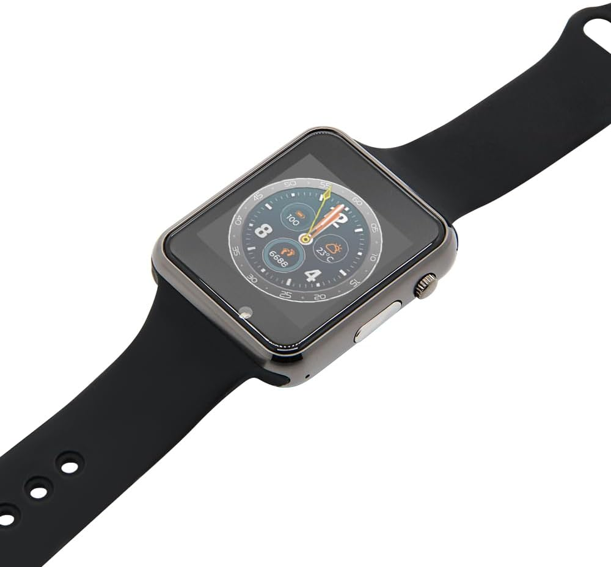

# XNODE

Git-tracked home for the active LilyGO Watch Gen3 / T-Watch S3 XNODE firmware.

Workspace paths:
- Active project: `C:\GitHub\XNODE`
- Archived legacy generations: `C:\GitHub\XNODE\obsolete\backup`

## Buy the watch

[](https://amzn.to/4sHfvgK)

Hardware listing:
- [LILYGO T-Watch S3 on Amazon](https://amzn.to/4sHfvgK)

## Current status

Working now:
- Builds for `t-watch2020-v3-s3`.
- Flashes to the LilyGO Watch Gen3 / ESP32-S3 target.
- Accepts one installed XNODE basemap tile in watch flash.
- Shows that installed tile in the map app without switching to stale old tiles.
- Zoom buttons scale the same installed image instead of loading another map.
- Markers stay aligned with the map image as zoom changes.
- Map panning works in watch-flash mode.
- Map swipe direction is corrected only inside the map view.

Known limits:
- Watch-flash mode is a single installed raster tile, not a multi-tile slippy engine.
- Zoom is image scaling around the installed tile center.
- Panning is constrained by the visible image bounds.

## Repo layout

The active firmware now lives here in git:
- `boards/`
- `data/`
- `images/`
- `lib/`
- `src/`
- `support/`
- `platformio.ini`

Legacy working copies and old generation snapshots were moved under:
- `C:\GitHub\XNODE\obsolete\backup`

That archive is for reference and rollback only. New work should happen in `C:\GitHub\XNODE`.

The repo also vendors the required T-Watch S3 support libraries under:
- `support/twatch-s3-libdeps`

That removes the last build dependency on `C:\GitHub\lilygo`.

## Map install flow

The XNODE watch map path is:

1. XTOC or XCOM fetches one raster tile for a chosen center and zoom.
2. The host sends the tile over the XNODE bridge as `mapTile`.
3. The tile is written to:

```text
/spiffs/osmmap/<z>/<x>/<y>.png
```

4. The host sends `installBasemap` with center longitude, latitude, and zoom.
5. The watch persists that manifest and uses the installed tile in `offline from watch flash`.

Behavior on the watch:
- zoom in/out scales the installed tile
- directional controls pan around the tile
- long press recenters to the stored map center
- markers are projected with Web Mercator math and stay in the right position as zoom changes

## Controls in watch-flash mode

- `+` / `-`: zoom the installed image
- directional inputs: pan the current view
- long press center/select: recenter the map

The minimum zoom is clamped so the tile still fills the display frame. The app should never shrink to a tiny image in the middle with no usable controls.

## Files that implement the map fix

- `src/hardware/ble/xnode.cpp`
  - accepts `mapTile` uploads
  - creates `/spiffs/osmmap/<z>/<x>` before writing
  - writes PNG chunks into the final flash tile path
- `src/app/osmmap/config/osmmap_config.cpp`
- `src/app/osmmap/config/osmmap_config.h`
  - persist installed basemap center and zoom
- `src/app/osmmap/osmmap_app_main.cpp`
  - resolves watch-flash mode to the installed tile
  - scales one image across zoom levels
  - applies pan offsets only in map mode
  - keeps swipe inversion local to the map view
- `src/utils/osm_map/osm_map.cpp`
- `src/utils/osm_map/osm_map.h`
  - Web Mercator projection helpers for marker placement

## XTOC / XCOM integration

Host-side install support lives in:
- `C:\GitHub\XTOC\xtoc-web\src\pages\XnodePage.tsx`
- `C:\GitHub\XTOC\xtoc-web\src\core\xnodeBridge.ts`
- `C:\GitHub\xcom\xcom\modules\shared\xnode\xnodeBridge.js`
- `C:\GitHub\xcom\xcom\modules\xnode\xnode.js`

These flows now support installing the active raster tile onto the watch using the existing XNODE install path.

## Build

From `C:\GitHub\XNODE`:

```powershell
pio run -e t-watch2020-v3-s3
```

## Flash

Check the active USB port first:

```powershell
Get-CimInstance Win32_SerialPort | Select-Object DeviceID, Description, PNPDeviceID
```

Then flash:

```powershell
pio run -e t-watch2020-v3-s3 -t upload --upload-port COM8
```

Last confirmed watch upload in this workspace used `COM8`.

If the watch does not auto-reset into bootloader mode, put it into boot mode manually and rerun the upload command on the current port.

## Quick verification

1. Build and flash from `C:\GitHub\XNODE`.
2. Open XTOC or XCOM and connect to the watch.
3. Load and install a map tile.
4. On the watch, open the map app and use `offline from watch flash`.
5. Confirm:
   - the same image stays loaded while zoom changes
   - the map still fills the screen at maximum zoom-out
   - markers remain visible and aligned
   - panning moves the viewed area without affecting the rest of the watch UI
