# XNODE

Git-tracked home for the active LilyGO Watch Gen3 / T-Watch S3, T-Watch Ultra, and T-Deck Plus XNODE firmware.

Workspace paths:
- Active project: `C:\GitHub\XNODE`
- Archived legacy generations: `C:\GitHub\XNODE\obsolete\backup`

## Watch screens

These XNODE screens show the LilyGO T-Watch S3 firmware and the current T-Watch Ultra build in daily use.

### Current T-Watch Ultra build

| Current clock | GPS diagnostics | Map with GPS position | Map overlay close-up |
| --- | --- | --- | --- |
| 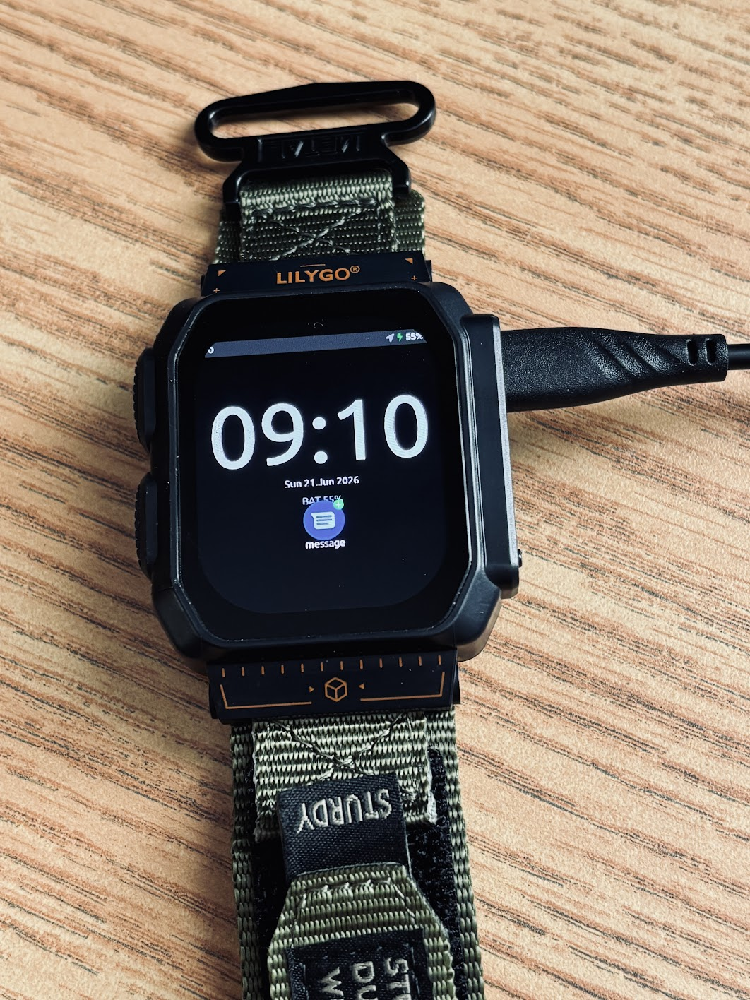 | 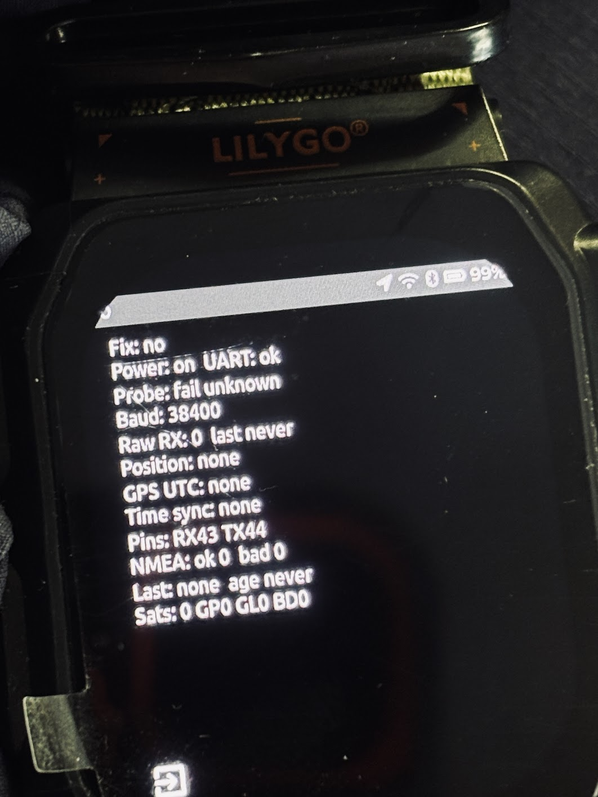 | 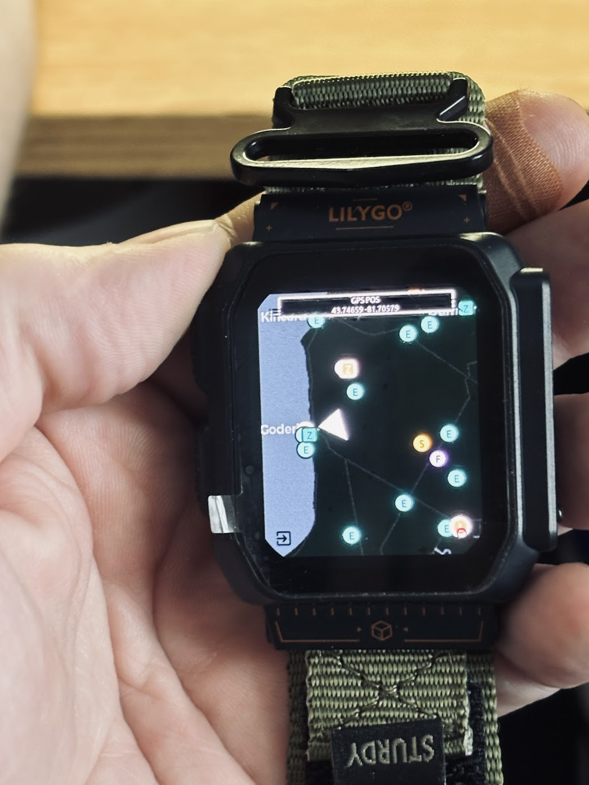 | 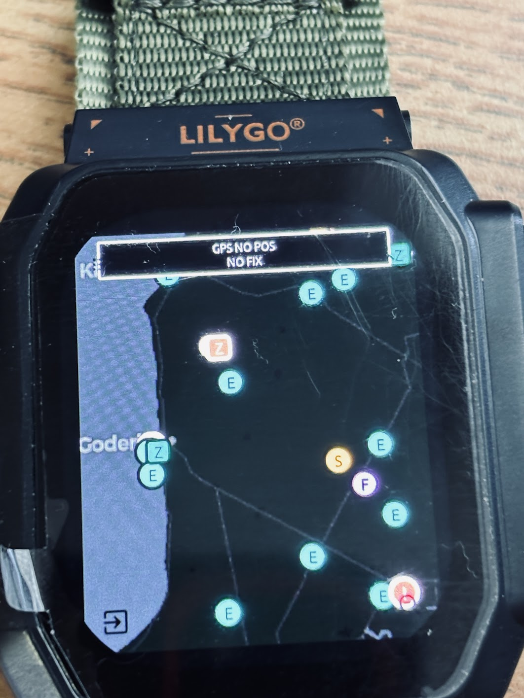 |
| Current watchface/clock view on the Ultra hardware. | GPS status page for hardware bring-up and live receiver checks. | Tactical map with current position and XTOC/XCOM overlay markers. | Close-up map/GPS state with synced overlay symbols on the installed basemap. |

### Current T-Deck Plus build

The T-Deck Plus target carries the XNODE workflow onto a larger 320x240 screen with a built-in hardware keyboard. It keeps the watch launcher, message, mesh, GPS, tactical map, SOS, and CheckIn flows, but makes message entry and map/diagnostic viewing less cramped than a watch-only display.

| Clock + moon | Launcher | Utilities | Mesh compose | CheckIn |
| --- | --- | --- | --- | --- |
| 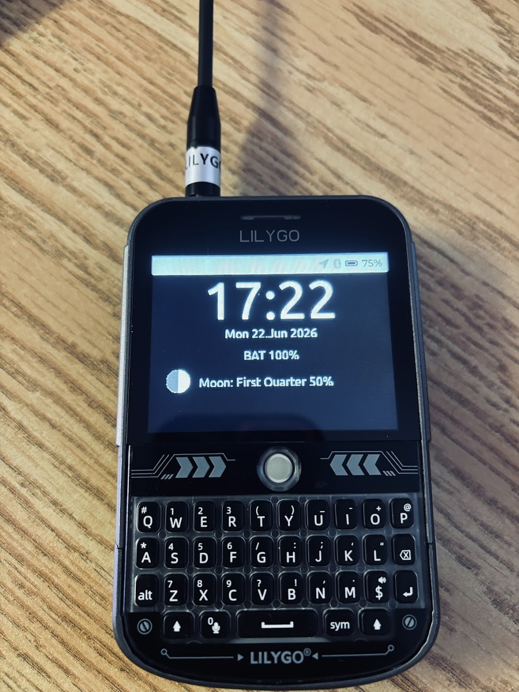 | 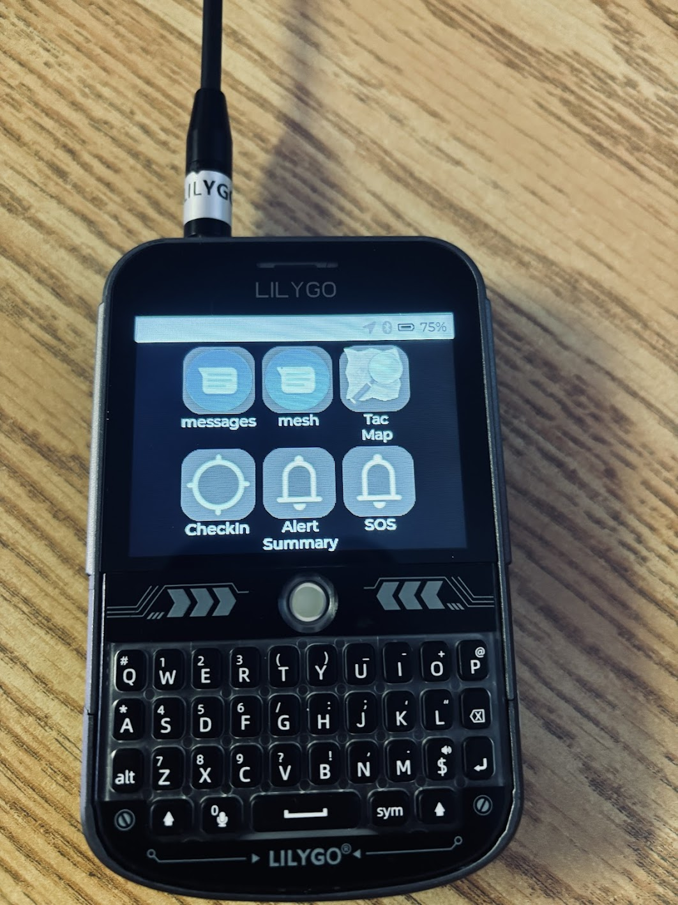 | 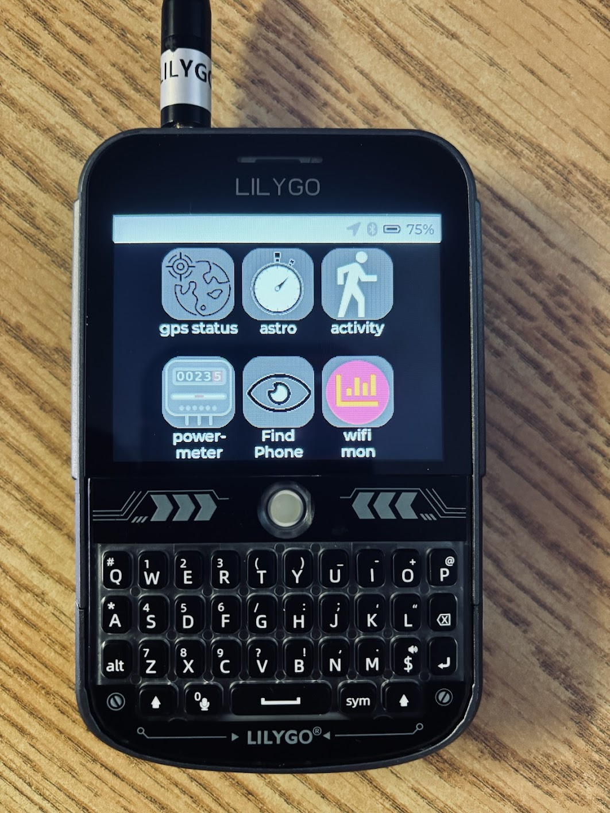 | 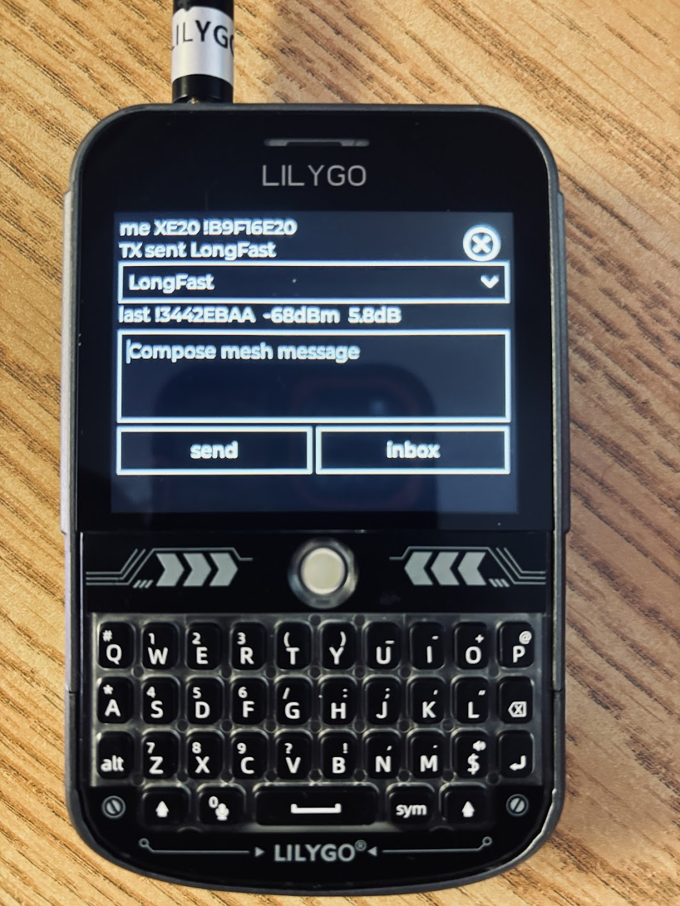 | 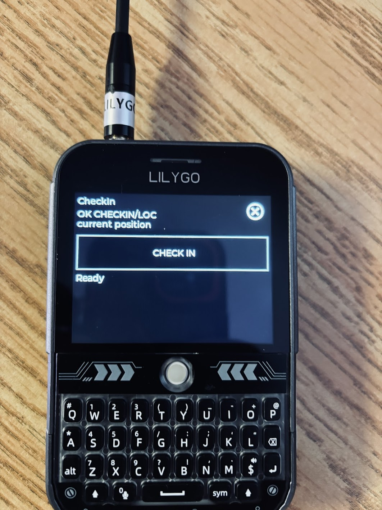 |
| Larger clock face with the moon phase indicator. | Main XNODE actions on the larger T-Deck display. | GPS/status utilities available from the launcher. | Physical keyboard entry for mesh messages. | Fast CheckIn packet flow with current position. |

### T-Watch S3 reference screens

| Launcher | Tactical map | XNODE alerts |
| --- | --- | --- |
| 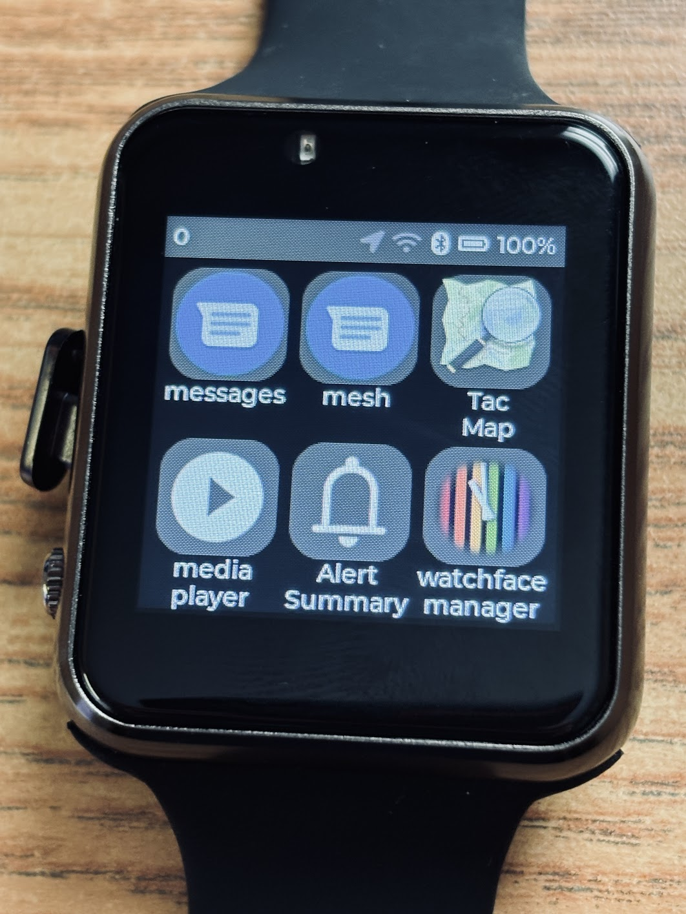 | 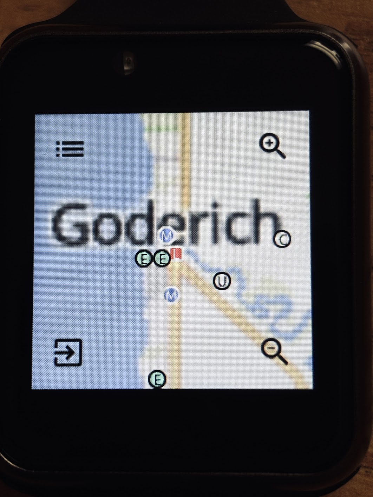 | 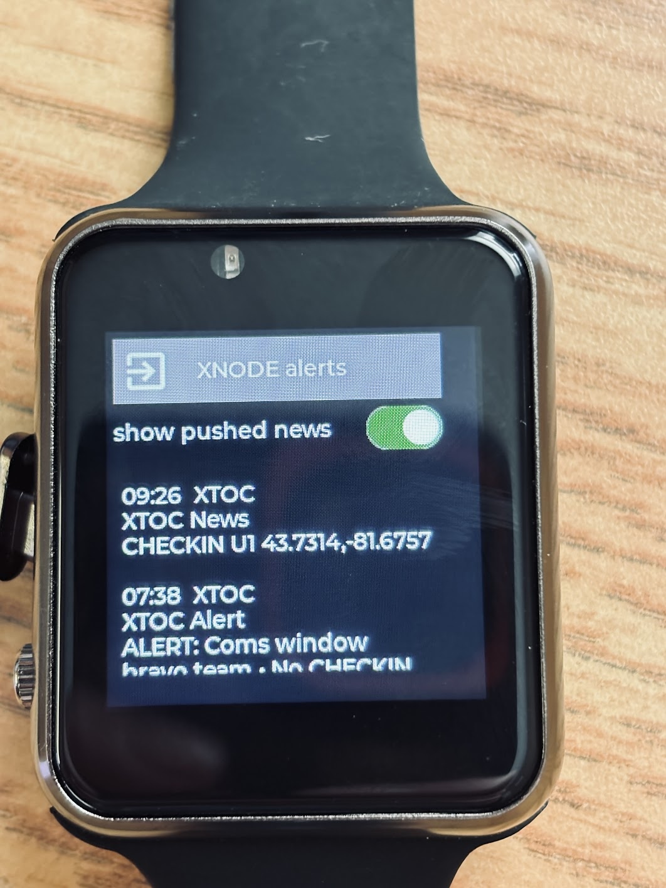 |
| App launcher for messages, mesh, the tactical map, media controls, alert summary, and watchface management. | Tactical map view with the installed basemap, synced XTOC/XCOM markers, zoom controls, and map menu access. | Alert/news view for XTOC-pushed check-ins, operator alerts, and other watch-visible updates. |

## Buy the watch

[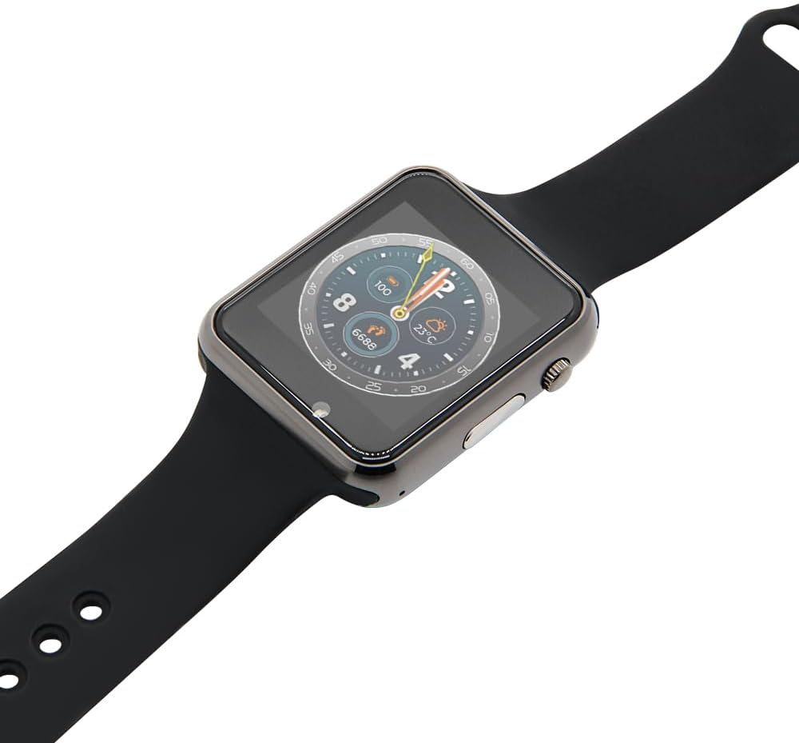](https://amzn.to/4sHfvgK)

Hardware listing:
- [LILYGO T-Watch S3 on Amazon](https://amzn.to/4sHfvgK)

## Companion software

XNODE is built to work with the MKME X software stack. Add the companion software below to turn the watch into part of a larger offline tactical comms, mapping, and intelligence workflow.

- [XTOC - Tactical Operations Center Software Suite](https://store.mkme.org/product/xtoc-tactical-operations-center-software-suite/) - Offline command-center software for SITREPs, TASKs, CHECKIN/LOC, map overlays, zones, SATCOM, ATAK/KML/CoT workflows, and packet-based field coordination. XTOC directly interfaces with XNODE over the BLE bridge to move maps, markers, locations, alerts, and operational data back and forth.
- [XCOM - Offline Radio Communication Suite](https://store.mkme.org/product/xcom-offline-radio-communication-suite/) - Offline-first radio and mapping toolkit with repeater maps, packet stations, callsign lookup, mesh/Reticulum support, and XTOC data import. XCOM also directly interfaces with XNODE over the BLE bridge so operators can send and receive watch-ready map, alert, location, and packet data.
- [XCORE - Offline Tactical AI Analyst](https://store.mkme.org/product/xcore/) - Local Windows AI analyst for XTOC/XCOM operational data, including AO summaries, anomaly scans, 24-hour SITREPs, aircraft pattern checks, and structured packet drafting.
- [XINTEL - Radio Intel Monitor + Transcription](https://store.mkme.org/product/xintel/) - Local radio-intelligence monitor that transcribes legally receivable audio, watches for keyword/rule hits, decodes ViperGram bursts, and pushes structured intel into the XTOC/XCOM workflow.

## Current status

Working now:
- Builds for `t-watch-ultra`, `t-watch2020-v3-s3`, and `tdeck-plus`.
- Flashes to the LilyGO Watch Gen3 / ESP32-S3 target.
- Builds and flashes the LilyGO T-Deck Plus target from this repo with the in-repo HAL, board file, post-upload watchdog reset, and reliable `460800` baud upload setting.
- Exposes the XNODE BLE bridge to XTOC and XCOM with `sync`, `location`, `meshtastic`, `basemap`, `mapOverlay`, `newsNotifications`, and `ble` capabilities.
- Adds a Manual SOS launcher tile that sends a clear XTOC `SITREP` packet over the watch's Meshtastic radio, with the roster Unit ID, destination Unit ID, `P1`, `HELP`, current lat/lon, and note `Manual SOS`.
- Adds a CheckIn launcher tile that sends a clear XTOC `CHECKIN/LOC` packet over the watch's Meshtastic radio, with the roster Unit ID, `OK` status, current lat/lon, and timestamp.
- Installs the active XTOC/XCOM tactical map raster as the watch basemap in SPIFFS and selects `offline from watch flash` on the watch.
- Replaces the active basemap cleanly with `clearBasemap` plus a streamed `mapTile` upload, so stale seed or old tiles do not bleed into the current map.
- Persists the installed basemap center, zoom, and projection zoom so the same map returns after reboot.
- Displays local position, shared location, Meshtastic position updates, and XTOC/XCOM overlay markers on the tactical map.
- Supports watch markers for team members, mesh nodes, SITREPs, CONTACTs, TASKs, CHECKINs, resource requests, assets, zones, missions, events, phase lines, Sentinel, and routes.
- Uses host-projected `mapX`/`mapY` marker placement when provided, with Web Mercator lon/lat projection as the fallback.
- Keeps markers aligned while zooming and panning the installed watch-flash basemap.
- Persists synced overlay markers in `/spiffs/osmmap/overlays.jsonl` and reloads them when the map opens or the watch reboots.
- Applies replacement overlay syncs transactionally: existing markers stay visible until the expected replacement batch arrives; an intentional zero-count replacement clears the cache.
- Stores XTOC/XCOM pushed news and alert items in the XNODE alerts app, with the watch-side `show pushed news` toggle.
- Removes the main clock-screen message shortcut after the user opens the message view, while keeping the stored messages and the messages launcher entry intact.
- Supports T-Deck Plus as a larger-screen XNODE device with a physical keyboard, readable GPS diagnostics, Launcher-usable firmware output, and the same core mesh/map/alert workflows.
- Keeps the launcher functions active for messages, mesh, Tac Map, media player, Alert Summary, and watchface manager.
- Inactivity timeout returns the T-Watch S3 build to standby instead of leaving it awake indefinitely.
- T-Watch S3 standby uses the LilyGo `ext1` touch wake path on `BOARD_TOUCH_INT`.
- Display timeout settings use a real `15..300` second range. `300` is five minutes, not a hidden never-sleep mode.

Known limits:
- Watch-flash mode is a single installed raster tile, not a multi-tile slippy engine.
- Zoom is image scaling around the installed tile center.
- Panning is constrained by the visible image bounds.
- The watch keeps up to 96 overlay markers; when full, the oldest marker slot is reused.
- The active watch basemap is one current image, not a stored library of selectable maps.
- SPIFFS is small, so host-side tooling must keep the installed raster compact.
- Manual SOS requires a configured watch Unit ID, a valid watch location, and a ready Meshtastic radio/channel before it can transmit.
- CheckIn requires the same watch Unit ID, valid watch location, and ready Meshtastic radio/channel.

## T-Deck Plus support

This branch adds a LilyGO T-Deck Plus target while preserving the active Ultra and S3 watch targets. The T-Deck build is intended to run from this repo and to produce a binary that can be loaded manually or by the bmorcelli Launcher.

Build from this repo:

```powershell
pio run -e tdeck-plus
```

Flash the attached T-Deck Plus:

```powershell
pio run -e tdeck-plus -t upload --upload-port COM20
```

Firmware output for Launcher or manual install:

```text
.pio/build/tdeck-plus/firmware.bin
```

Board and upload support:
- Uses dedicated `boards/tdeck_plus.json` and `[env:tdeck-plus]` entries.
- Uses only code and support libraries in this repo plus the already-declared PlatformIO dependencies.
- Uses DIO flash mode for the T-Deck Plus boot header; QIO produced reset loops on the attached unit.
- Upload speed is set to `460800` because `921600` was unreliable on the attached unit and could drop mid-flash.
- `support/tdeck_plus_post_upload_reset.py` runs after upload and issues a watchdog reset so the device does not stay trapped in the flasher stub.
- GitHub Actions runs `npm run build`, which executes the regression checks and builds `t-watch-ultra`, `t-watch2020-v3-s3`, and `tdeck-plus`.

Hardware mapped in the in-repo HAL:
- ESP32-S3 with 16 MB flash and 8 MB PSRAM.
- 320x240 ST7789 display with TFT CS/DC/backlight on GPIO `12/11/42`.
- GT911 touch on I2C GPIO `18/8` with touch interrupt GPIO `16`.
- Hardware keyboard on the T-Deck I2C keyboard controller at address `0x55`, with keyboard interrupt GPIO `46`.
- SX1262 LoRa on shared SPI GPIO `41/38/40`, CS `9`, BUSY `13`, RST `17`, DIO1 `45`.
- GPS on `Serial1`, RX `44`, TX `43`.
- SD card CS `39` on the same SPI bus.
- Battery voltage from ADC GPIO `4`.

Runtime behavior now wired:
- Initializes display, backlight, touch, shared SPI, SD, GPS UART, battery ADC, and SX1262 module pins from `src/hardware/tdeck_plus_hal.*`.
- Uses the larger 320x240 rectangular UI path with the same app launcher, messages, mesh, Tac Map, Alert Summary, SOS, CheckIn, and watchface flows used by the watch builds.
- Uses the watch-style high-contrast T-Deck theme and clamps invalid or unreadable saved themes so dark text on dark backgrounds cannot persist after changing display settings.
- Shows the generated moon phase text and visual on the main screen.
- Applies the same safe build-time clock fallback used by Ultra, then lets GPS UTC replace it once the receiver has valid date/time.
- Removes the clock-screen message shortcut after messages are viewed, without deleting stored messages or hiding the messages launcher entry.
- Keeps the on-screen LVGL keyboard disabled on T-Deck Plus. Text entry uses the physical keyboard and injects printable keys, backspace/delete, enter, and escape into the focused LVGL textarea.
- Treats T-Deck Plus as a Meshtastic `T_DECK` hardware model for onboard radio and BLE user config paths.
- Disables and hides motion/pedometer UI for T-Deck Plus because this target does not currently have an implemented BMA/BHI motion sensor path.

GPS status:
- GPS defaults on for T-Deck Plus so map position and GPS time sync can work without a user manually enabling GPS first.
- GPS power setup forces the receiver pins to `RX44/TX43` mode and enables the board power path before probing.
- Receiver init supports the LilyGO GPS Shield/L76K PCAS sequence and a u-blox/M10 fallback probe at `38400` and `9600`.
- The GPS status page uses a full-width readable diagnostics layout for fix, power, UART, probe result, baud, raw RX count, NMEA checksum counts, position, GPS UTC, time sync, pins, last sentence, and satellites.
- GPS stays powered through T-Deck display timeout/standby handoff so receiver state is not lost while debugging or waiting for lock.

Display timeout and wake behavior:
- T-Deck Plus display timeout blanks the backlight but does not enter the full watch standby path.
- LVGL task handling, touch, and keyboard polling stay active while the display is blanked. This avoids the slow-motion/stutter state seen when the T-Deck UI stack was partially suspended.
- Touch and hardware keyboard interrupts are wired as wake/activity sources.
- The T-Deck display sleep path avoids ST7789 sleep/wake commands that caused flashing and failed wake on the attached hardware.

Launcher compatibility:
- The bmorcelli Launcher can install/run ESP32 binaries from SD/WebUI/GitHub links. Use `.pio/build/tdeck-plus/firmware.bin` as the app binary for this branch.
- This repo does not yet include a Launcher package manifest, icon bundle, or release-hosted binary URL. It currently produces the binary that Launcher can load.

Pre-merge verification commands:

```powershell
npm run build
```

Known T-Deck Plus limits:
- Support has been build-verified and flashed on the attached T-Deck Plus, but it still needs more field validation.
- Trackball handling is not wired yet.
- Speaker, microphone, IMU/compass, pedometer, and RTC alarm integration are not implemented for T-Deck Plus yet.
- T-Deck Plus does not expose an onboard vibration motor in the current LilyGO T-Deck Plus hardware target; XNODE logs that haptics are unavailable and leaves motor feedback as a no-op on this target.
- Battery reporting is an ADC estimate, not a PMU fuel-gauge reading.
- GPS still requires real satellite lock. On the GPS status page, `Raw RX:0` means the receiver is silent or not wired/powered; rising `Raw RX` with `NMEA` counts means the receiver is talking; a valid map/time fix still requires satellites.
- T-Deck Plus display timeout currently favors UI responsiveness over deepest idle power because the full watch standby path left the T-Deck UI sluggish after wake.
- OTA URL is intentionally blank for this new target until a release path exists.
- T-Deck Pro/Max are not targeted here; this branch is specifically for T-Deck Plus.

## Power management status (2026-06-21)

Current verified firmware baseline:
- `t-watch-ultra`: built, flashed, and post-upload watchdog reset verified on the T-Watch Ultra.
- `t-watch2020-v3-s3`: built successfully after the shared power/config changes to protect the other watch variant.
- `tdeck-plus`: built, flashed on `COM20`, and post-upload watchdog reset verified on the attached T-Deck Plus.
- Latest power audit commit: `5ae38af Improve T-Watch Ultra battery life`.

### Variant status

| Area | T-Watch Ultra | T-Watch S3 / Gen3 | T-Deck Plus |
| --- | --- | --- | --- |
| Idle timeout | Uses the shared display activity timer and standby request path. | Uses the shared display activity timer and restored timeout-to-standby path. | Blanks the backlight but keeps LVGL/touch/keyboard active to avoid post-wake UI stutter. |
| Display standby | AMOLED brightness is set to zero and the panel is put into `display.sleep()`. | Backlight/display is turned off through the S3/LilyGo path. | Avoids ST7789 sleep/wake commands; backlight is driven directly. |
| Touch wake | Touch/display rail stays powered because it is shared; touch interrupt can wake the watch. | Uses LilyGo-style `ext1` wake on `BOARD_TOUCH_INT`. | Touch and hardware keyboard interrupts are activity/wake sources. |
| GPS at boot | Off by default after one-time config migration. | Existing behavior preserved. | On by default so GPS time/map location can work without manual enable. |
| GPS while using map | Tac map can still auto-start GPS for the user-location marker. | Existing behavior preserved. | Uses the same map GPS path and the T-Deck Serial1 GPS receiver. |
| GPS in standby | Off unless an app explicitly blocks standby. GPS status no longer enables standby GPS. | Existing tracker/status behavior preserved. | Kept powered across the T-Deck display timeout path so receiver lock/debug state is not lost. |
| WiFi at boot | Off by default after one-time config migration; dummy setup scan disabled. | Existing behavior preserved. | Existing config path preserved; not auto-enabled by the T-Deck bring-up. |
| BLE at boot | Off by default after one-time config migration; BLE stack is lazy-initialized. | Existing auto-on behavior preserved unless config says otherwise. | Uses the XNODE/Meshtastic BLE paths when enabled or when host sync needs them. |
| LoRa / Meshtastic | Radio chip is put into sleep on standby; regulator rail is not cut yet to avoid a risky radio re-init path. | Existing behavior preserved. | SX1262 pins and `T_DECK` Meshtastic model are wired; radio power-cut policy is not finalized. |
| CPU performance mode | Active tac map and normal awake watchface use performance mode; standby handoff, hibernate, and the GPS loop do not globally pin performance. | Shared change applies; S3 build verified. | Display timeout stays in active UI mode; active apps keep normal responsiveness instead of waking into a suspended UI. |

### What changed in the Ultra audit

GPS:
- Removed the Ultra-only code that forced `/gpsctl.json` `autoon=true` at every boot.
- Added `GPSCTL_CONFIG_VERSION` and a one-time Ultra migration that sets `autoon=false` and `enable_on_standby=false`.
- GPS BLDO1 is disabled at Ultra PMU boot instead of being left powered.
- The Ultra auto-off path explicitly shuts down the GPS UART and GPS regulator.
- The GPS loop no longer calls `powermgm_set_perf_mode()`, so GPS reads do not pin the CPU in full-speed mode.
- The GPS status page powers GPS only while active and no longer requests GPS to stay on in standby.

WiFi:
- Added `WIFICTL_CONFIG_VERSION` and a one-time Ultra migration that turns off WiFi auto-on, standby WiFi, web server, and FTP server.
- Ultra no longer inserts the dummy `foo` / `bar` network at setup, which prevented an unwanted boot-time WiFi scan.
- WiFi can still be turned on from the UI/statusbar when needed.

BLE:
- Added `BLECTL_CONFIG_VERSION` and a one-time Ultra migration that turns off BLE auto-on, advertising, standby BLE, and disconnect-only standby blocking.
- BLE advertising now only starts when BLE is actually on.
- BLE stack initialization is lazy, so the controller is not brought up on Ultra boot when BLE is off.
- Turning BLE on later still initializes the normal services, including Gadgetbridge, XNODE, battery/steps, and Meshtastic BLE.

Display and PMU rails:
- Ultra GPS BLDO1 and haptic BLDO2 start disabled at PMU boot.
- Ultra haptic expander enable starts low; `WATCH_POWER_DRV2605` controls the rail and enable line together.
- Ultra haptic feedback lazy-initializes the DRV2605 at `0x5A`, plays the configured click waveform, then cuts the haptic rail again.
- T-Watch S3 keeps the existing LilyGO `SensorDRV2605` path.
- Ultra standby defensively cuts GPS and haptic power again before entering light sleep.
- Ultra display standby now calls `display.sleep()` after setting brightness to zero, and wake calls `display.wakeup()`.
- The shared display/touch rail is intentionally not cut on Ultra because touch wake depends on it.

Apps and CPU mode:
- Tac map activation uses performance mode while the map is open so zoom, pan, and map buttons stay responsive; closing/hibernating the map returns normal mode.
- Watchface activation uses performance mode for normal awake use, but the standby handoff and hibernate path force normal mode so the idle sleep path is not pinned high.
- The GPS loop no longer calls `powermgm_set_perf_mode()`, so background GPS reads do not pin the CPU in full-speed mode.
- Tac map still auto-starts GPS when its `autostart gps` option is enabled so the large GPS triangle can appear.
- Tac map WiFi auto-start defaults off on Ultra after a one-time `OSMMAP_CONFIG_VERSION` migration.

Display brightness:
- `DISPLAY_CONFIG_VERSION` was bumped to `2`.
- On Ultra only, old configs above half brightness are migrated once down to `DISPLAY_MAX_BRIGHTNESS / 2`.
- The user can still raise brightness after the migration; the firmware does not force it down every boot.

### Expected Ultra behavior now

Normal idle:
- Screen fades after the configured display timeout, the AMOLED panel sleeps, and the watch enters light sleep if no subsystem blocks standby.
- GPS, WiFi, BLE advertising, and the unused haptic rail should not be running on a clean idle boot.
- The watch should wake by touch/power/PMU events without requiring a reboot.

Opening the tac map:
- GPS may power on if map `autostart gps` is enabled.
- WiFi should not auto-start unless the map/user config explicitly enables it.
- The map uses performance mode while open and returns normal mode when closed.

Opening GPS status:
- GPS powers on so live debug fields can update.
- Leaving the page restores the previous GPS auto-on and standby settings.
- The page does not keep GPS alive through standby.

Turning BLE or WiFi on manually:
- BLE and WiFi still work from the normal UI/statusbar paths.
- Those radios will cost battery while enabled, especially BLE advertising and WiFi scanning/connection attempts.

### Known power tradeoffs still open

- Meshtastic LoRa regulator power is not cut in standby. The SX1262 is put to sleep, but cutting the rail safely needs a full radio re-init path on wake.
- OTA/update still uses `powermgm_set_perf_mode()` intentionally while flashing or updating.
- `powermgm_set_lightsleep(false)` users in OTA and battery calibration still need a paired release audit, as noted in the older S3 audit.
- Any app that explicitly enables GPS-on-standby, WiFi-on-standby, BLE always-on, or long display timeout will reduce battery life by design.

### Power verification commands

Build Ultra:

```powershell
pio run -e t-watch-ultra
```

Build S3 / Gen3 regression target:

```powershell
pio run -e t-watch2020-v3-s3
```

Build T-Deck Plus:

```powershell
pio run -e tdeck-plus
```

Flash Ultra from this repo:

```powershell
pio run -e t-watch-ultra -t upload
```

After flashing, confirm the watch re-enumerates:

```powershell
pio device list
```

## Automated CI and regression testing

The repo has a regression and firmware-build workflow at `.github/workflows/ci.yml`.
It runs on push, pull request, and manual dispatch. The workflow installs PlatformIO `6.1.19` and runs:

```powershell
npm run build
```

The current `npm test` command runs the watch overlay persistence check and the structural regression checks:

```powershell
npm test
```

The current `npm run build` command runs `npm test` and then compiles:

```powershell
pio run -e t-watch-ultra -e t-watch2020-v3-s3 -e tdeck-plus
```

The regression gate protects the recent watch fixes:
- Ultra shared image buttons respond on press and suppress duplicate clicks.
- SOS, Check-In, Alert Summary, Bluetooth message, Meshtastic, and Tac Map controls keep large Ultra press targets.
- The main clock-screen message shortcut disappears after messages are viewed, while stored messages remain available from the messages menu.
- Tac Map keeps the large GPS user marker, heading update path, topmost marker ordering, and active map performance mode.
- Tac Map still auto-starts GPS for the user marker, while Ultra WiFi auto-start defaults off.
- GPS, WiFi, BLE, display sleep/wake, and PMU idle-power defaults stay wired for the Ultra battery fixes.
- Ultra pedometer step continuity survives raw sensor counter resets.
- The multi-page watch keyboard keeps A-M, N-Z, caps, symbols, space, and backspace handling.
- The Ultra main screen keeps the generated moon phase text and visual indicator.
- T-Deck Plus keeps the moon phase indicator, hides unsupported pedometer state, uses readable GPS status diagnostics, keeps the Serial1/L76K/u-blox GPS init path, applies GPS UTC time sync to the main clock, uses DIO flash mode, and avoids full UI standby on display timeout.
- CI now builds all three supported firmware targets so Ultra, S3/Gen3, and T-Deck Plus regressions fail before merge.

If this gate fails, either restore the protected behavior or update the check in
the same change with the intentional replacement behavior.

## Power management audit (2026-04-18)

Scope:
- Board/environment: `t-watch2020-v3-s3`
- Problem reported: the watch stayed awake, the screen did not time out reliably, and the battery drained quickly.

Root cause found:
- `src/gui/gui.cpp` had a `LILYGO_WATCH_S3` special case that skipped the normal timeout-to-standby request path entirely.
- `src/hardware/touch.cpp` put the S3 touch controller into monitor mode for standby, but used a custom GPIO light-sleep wake path instead of the LilyGo S3 `ext1` touch wake path.
- The S3 touch path also read touch coordinates without first checking the touch interrupt state, which increased the chance of false activity and unnecessary polling.
- The saved display timeout still treated `300` as a hidden "no timeout" value, so older settings could keep the watch awake forever even after the standby path was restored.
- Activity resets relied too much on LVGL inactivity tracking, which did not consistently follow every wake source on the S3 build.

Fix applied:
- Re-enabled timeout-driven `POWERMGM_STANDBY_REQUEST` handling for the S3 build in `src/gui/gui.cpp`.
- Changed S3 standby wake to match the LilyGo library path in `lib/twatchs3_core/src/LilyGoLib.cpp`: `esp_sleep_enable_ext1_wakeup(_BV(BOARD_TOUCH_INT), ESP_EXT1_WAKEUP_ALL_LOW)`.
- Gated S3 touch reads on `watch.getTouched()` before reading coordinates in `src/hardware/touch.cpp`.
- Added a firmware-side display activity timer that is reset by touch, button presses, wake requests, alarms, notifications, and explicit keep-awake flows.
- Changed timeout handling so the persisted user setting is always `15..300` seconds. Temporary keep-awake behavior now uses the internal `DISPLAY_NO_TIMEOUT` override instead of the old magic `300` value.
- Added a legacy config migration so pre-fix `/display.json` files that stored `300` as the old never-sleep value are converted once to `15` seconds on boot and then rewritten.
- Fixed S3 standby wake handoff so a touch wake from light sleep becomes a normal `POWERMGM_WAKEUP_REQUEST` and the display comes back without a reboot.

Files changed for this fix:
- `src/gui/gui.cpp`
- `src/hardware/touch.cpp`
- `src/hardware/display.cpp`
- `src/hardware/display.h`
- `src/hardware/config/displayconfig.cpp`
- `src/hardware/button.cpp`
- `src/hardware/powermgm.cpp`
- `src/gui/splashscreen.cpp`
- `src/gui/quickbar.cpp`
- `src/gui/mainbar/mainbar.cpp`
- `src/gui/mainbar/setup_tile/display_settings/display_setting.cpp`
- `src/gui/mainbar/setup_tile/watchface/watchface_manager_app.cpp`
- `src/gui/mainbar/setup_tile/update/update.cpp`
- `src/gui/mainbar/setup_tile/bluetooth_settings/bluetooth_message.cpp`
- `src/gui/mainbar/setup_tile/bluetooth_settings/bluetooth_media.cpp`
- `src/app/alarm_clock/alarm_in_progress.cpp`
- `src/app/wifimon/wifimon_app_main.cpp`
- `src/app/sailing/sailing_setup.cpp`

Build verification:
- Confirmed with:

```powershell
pio run -e t-watch2020-v3-s3
```

Flash verification:
- Last confirmed upload after this fix:

```powershell
pio run -e t-watch2020-v3-s3 -t upload --upload-port COM8
```

## Expected sleep / wake behavior

Display timeout:
- User setting range: `15` to `300` seconds in Display settings.
- `300` means `300 seconds` / `5 minutes`.
- There is no normal hidden never-sleep slider value anymore.

What happens when idle:
- The firmware starts fading the backlight during the last `brightness * 8 ms` before timeout.
- At the default mid brightness that fade is about `1 second`.
- At max brightness that fade is about `2.0 seconds`.
- When the timeout expires, the watch requests standby, turns the display off, and then enters ESP32-S3 light sleep if no other subsystem blocks it.

What counts as activity:
- Touch press.
- Side / power button press.
- Wake requests from notifications, media updates, alarms, splash/update UI, and other explicit wake paths.

Wake methods:
- Touch interrupt on `BOARD_TOUCH_INT` using ESP32 `ext1` wake, matching the LilyGo S3 library.
- Power / side button.
- Motion wake paths already wired through the BMA callback flow.
- RTC alarm / silence wake paths.
- PMU / charger related interrupts.
- Bluetooth notification/media wake when those options are enabled.

Touch wake interaction:
- One touch should wake the watch from standby.
- After wake, the normal next touch interaction should be able to scroll or change screens without forcing a full reboot.

Temporary no-timeout cases:
- Internal app flows can still keep the display awake with `DISPLAY_NO_TIMEOUT`.
- Current users are OTA update, watchface manager, Wi-Fi monitor, and the sailing app's explicit "Always on display" toggle.
- Those are runtime overrides, not saved Display settings.

Follow-up risk still open:
- `powermgm_set_lightsleep(false)` is called in `src/utils/http_ota/http_ota.cpp` and `src/gui/mainbar/setup_tile/battery_settings/battery_calibration.cpp`.
- Those paths do not currently show a matching release call in the same flow, so light sleep can remain disabled until reboot after those operations.
- That does not explain the idle timeout bug on a clean boot, but it is another battery-life issue worth fixing next.

## Repo layout

The active firmware now lives here in git:
- `boards/`
- `data/`
- `images/`
- `lib/`
- `src/`
- `support/`
- `platformio.ini`

Legacy working copies and old generation snapshots were moved under:
- `C:\GitHub\XNODE\obsolete\backup`

That archive is for reference and rollback only. New work should happen in `C:\GitHub\XNODE`.

The repo also vendors the required T-Watch S3 support libraries under:
- `support/twatch-s3-libdeps`

That removes the last build dependency on `C:\GitHub\lilygo`.

## Map install flow

The XNODE watch map path is:

1. XTOC or XCOM fetches one raster tile for a chosen center and zoom.
2. The host clears the active watch basemap state with `clearBasemap`.
3. The host streams the new image over the XNODE bridge with `mapTileBegin` / `mapTile`.
4. The active tile is written to:

```text
/spiffs/osmmap/current.png
```

5. The host sends `installBasemap` with center longitude, latitude, zoom, and projection zoom.
6. The watch persists that manifest and uses the installed tile in `offline from watch flash`.
7. The watch requests overlay sync for the active basemap, then stores synced overlay markers in `/spiffs/osmmap/overlays.jsonl`.

Behavior on the watch:
- zoom in/out scales the installed tile
- directional controls pan around the tile
- long press recenters to the stored map center
- markers are projected with Web Mercator math and stay in the right position as zoom changes
- host-projected marker pixels are used when the host generated the installed map image
- overlay markers persist across map close/open and watch reboot

## Controls in watch-flash mode

- `+` / `-`: zoom the installed image
- directional inputs: pan the current view
- long press center/select: recenter the map

The minimum zoom is clamped so the tile still fills the display frame. The app should never shrink to a tiny image in the middle with no usable controls.

## Files that implement the map fix

- `src/hardware/ble/xnode.cpp`
  - accepts `clearBasemap`, `mapTileBegin`, `mapTile`, `installBasemap`, `syncState`, `overlayBatch`, `packetBatch`, `newsItem`, and location commands
  - creates the watch basemap directory before writing
  - streams PNG chunks into `/spiffs/osmmap/current.png`
  - acknowledges overlay counts back to the host so XTOC/XCOM can verify sync progress
- `src/app/osmmap/config/osmmap_config.cpp`
- `src/app/osmmap/config/osmmap_config.h`
  - persist installed basemap center, zoom, and projection zoom
- `src/app/osmmap/osmmap_app_main.cpp`
  - resolves watch-flash mode to the installed tile
  - scales one image across zoom levels
  - applies pan offsets only in map mode
  - keeps swipe inversion local to the map view
  - stores and restores overlay markers from `/spiffs/osmmap/overlays.jsonl`
  - handles transactional overlay replacement so partial syncs do not wipe visible markers
- `src/utils/osm_map/osm_map.cpp`
- `src/utils/osm_map/osm_map.h`
  - Web Mercator projection helpers for marker placement

## XTOC / XCOM integration

Host-side install support lives in:
- `C:\GitHub\XTOC\xtoc-web\src\pages\XnodePage.tsx`
- `C:\GitHub\XTOC\xtoc-web\src\core\xnodeBridge.ts`
- `C:\GitHub\xcom\xcom\modules\shared\xnode\xnodeBridge.js`
- `C:\GitHub\xcom\xcom\modules\xnode\xnode.js`

These flows now support installing the active raster tile onto the watch using the existing XNODE install path.
They also sync visible tactical map markers to the watch as overlay batches, including packet/check-in style markers and host-projected marker pixels for the currently installed basemap.

Current host behavior:
- clear the watch basemap and overlay cache before installing a replacement map
- stream the active map image to `/spiffs/osmmap/current.png`
- send the basemap manifest with center and projection metadata
- send watch SOS configuration, including the roster-backed `Watch Unit ID` and `SOS To` Unit ID
- push overlay batches after the watch activates the basemap
- keep overlay markers persistent on the watch until a new complete replacement sync arrives
- push XTOC/XCOM news and alerts into the XNODE alerts app

## Manual SOS over Meshtastic

Manual SOS is a watch-side emergency shortcut. It does not send the distress packet back to the BLE host. When the operator opens `SOS` on the watch and taps `SEND SOS`, XNODE builds one clear XTOC `SITREP` packet and passes it to the watch Meshtastic service for transmission on the active Meshtastic channel.

Packet contents:

- packet family: `SITREP` v1
- source: the configured watch `Unit ID`
- destination: configured `SOS To` Unit ID, or `U0` for broadcast
- priority: `P1`
- status: `HELP`
- location: the watch's currently stored latitude/longitude
- note: `Manual SOS`

Real-world uses:

- injured, lost, trapped, or separated operator who cannot stop to use a phone or tablet
- vehicle crew, shelter lead, search team, or marshal who needs a fast distress cue on the same mesh net the TOC is already monitoring
- bad-weather, low-light, gloved, or high-stress conditions where a two-tap watch flow is more reliable than opening a full field app

Setup for success:

1. In `XTOC Team` or the `XCOM` imported roster, give every watch wearer a stable `Unit ID`.
2. In `XTOC -> XNODE` or `XCOM -> XNODE`, connect the watch, choose `Watch Unit ID` from the roster, choose `SOS To`, and click `Save`.
3. The watch stores this assignment in `/xnode.json` and reloads it after reboot. To clear it, reconnect from `XTOC`/`XCOM`, choose `Unassigned / clear saved watch ID`, and click `Save`.
4. Set the watch location from the XNODE page with `Set watch GPS + time`, `Share current GPS once`, or the GPS relay before relying on Manual SOS. Future GPS-equipped watches can provide this directly. Host-set location is also stored so the last known lat/lon survives reboot.
5. On the watch, open the `mesh` app and confirm the status is `Mesh ready` on the expected Meshtastic channel.
6. Send a short test mesh message and confirm the TOC mesh station can receive and auto-import XTOC packet text.

Use in the field:

1. Open the watch launcher.
2. Tap `SOS`.
3. Tap `SEND SOS`.
4. Confirm the watch shows `SOS sent over mesh`.

If it fails:

- `Set the watch Unit ID in XTOC/XCOM first.` means the watch has not received a roster Unit ID.
- `Set the watch location before sending SOS.` means no valid lat/lon has been stored yet.
- `Meshtastic not ready` means the onboard radio did not initialize or no usable channel is active.

The receiving TOC should leave mesh packet auto-decode enabled so the inbound `SITREP` lands in the normal packet store, timeline, triggers, and map workflows.

## CheckIn over Meshtastic

CheckIn is the routine one-button position report. It also transmits from the watch Meshtastic radio, not back through the BLE host.

Packet contents:

- packet family: `CHECKIN/LOC` v1
- source: the configured watch `Unit ID`
- status: `OK`
- location: the watch's currently stored latitude/longitude
- timestamp: current watch time, rounded to packet minutes

Real-world uses:

- shift start, staging arrival, checkpoint arrival, shelter arrival, route departure, vehicle stop, or post-task accountability
- routine "I am here and OK" updates from operators who should not be distracted by a phone screen
- last-known-position breadcrumbs for TOC staff when a field team only has time for a single button press

Use `CheckIn` for routine accountability. Use `SOS` when the operator needs help, safety response, or urgent TOC attention.

Setup is the same as Manual SOS:

1. Assign the watch wearer a stable roster `Unit ID`.
2. In `XTOC -> XNODE` or `XCOM -> XNODE`, connect the watch, choose `Watch Unit ID`, and click `Save`.
3. The watch keeps the saved Unit ID across reboot until `XTOC`/`XCOM` explicitly saves `Unassigned / clear saved watch ID`.
4. Set the watch location from the XNODE page or GPS relay before relying on CheckIn.
5. On the watch, open the `mesh` app and confirm `Mesh ready` on the intended channel.

Use in the field:

1. Open the watch launcher.
2. Tap `CheckIn`.
3. Tap `CHECK IN`.
4. Confirm the watch shows `Check-in sent over mesh`.

The receiving TOC should auto-decode mesh packets so the inbound `CHECKIN/LOC` updates the unit's latest position on the map and in the roster.

## Build

From `C:\GitHub\XNODE`:

```powershell
pio run -e t-watch-ultra
pio run -e t-watch2020-v3-s3
pio run -e tdeck-plus
```

## Flash

Check the active USB port first:

```powershell
Get-CimInstance Win32_SerialPort | Select-Object DeviceID, Description, PNPDeviceID
```

Then flash:

```powershell
pio run -e t-watch2020-v3-s3 -t upload --upload-port COM8
```

Last confirmed watch upload in this workspace used `COM8`.

If the watch does not auto-reset into bootloader mode, put it into boot mode manually and rerun the upload command on the current port.

## Quick verification

1. Build and flash from `C:\GitHub\XNODE`.
2. Open XTOC or XCOM and connect to the watch.
3. Load and install a map tile.
4. On the watch, open the map app and use `offline from watch flash`.
5. Confirm:
   - the same image stays loaded while zoom changes
   - the map still fills the screen at maximum zoom-out
   - markers remain visible and aligned
   - markers survive closing/reopening the map and rebooting the watch
   - a new packet/check-in sync updates markers without making existing markers vanish
   - panning moves the viewed area without affecting the rest of the watch UI
