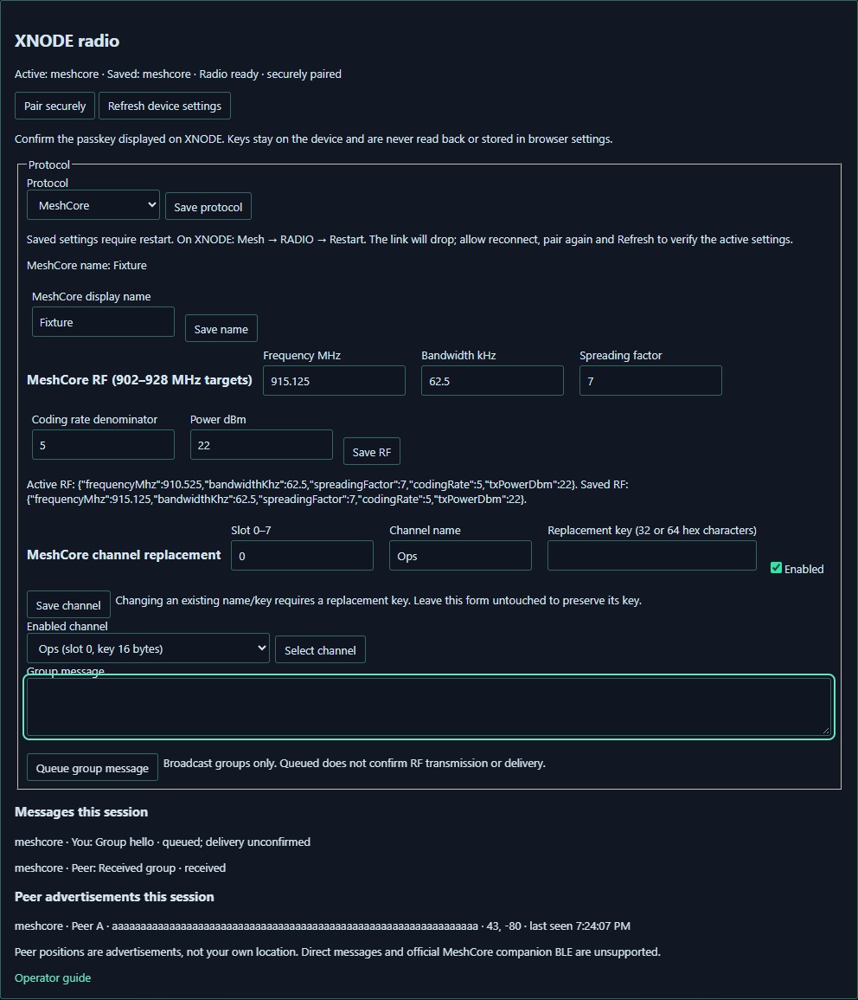
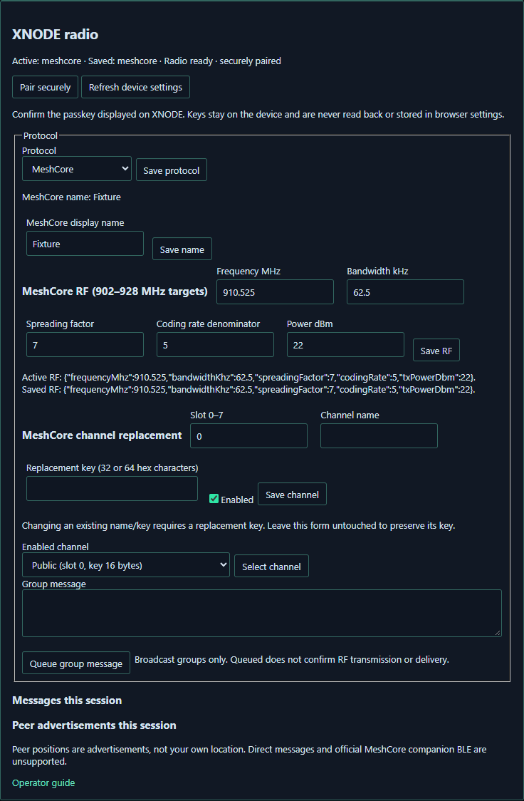
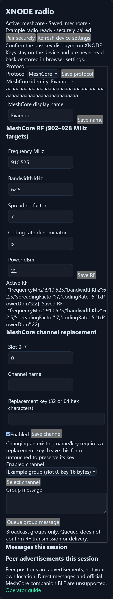

# XNODE dual-protocol operator workflow

The combined firmware must be installed **once** on a supported board. Separate stock Meshtastic and MeshCore images cannot be toggled by these controls. Subsequent protocol switches use saved settings and an on-device restart, without reflashing.

Current supported LoRa targets are `t-watch2020-v3-s3`, `t-watch-ultra`, `tdeck-plus` and `tdeck-pro`. Legacy non-LoRa environments in PlatformIO are not included in this acceptance. Only the boot-active protocol owns the single radio; simultaneous reception is unavailable. Each protocol retains its own identity, RF settings and channels. MeshCore supports group broadcast chat and signed peer position advertisements. Direct messages and official MeshCore companion BLE are unavailable. A received group sender label is not an individually authenticated sender identity.

Use XTOC's XNODE page on a supported tablet/computer, or XCOM's XNODE module (including its mobile drawer). These clients use XNODE BLE, not a fabricated native MeshCore transport. XTOC remains local-first and needs no production server. Web Bluetooth needs a supported browser and secure origin; installed offline use retains the usual browser requirements. The development simulator does not provide authenticated BLE provisioning.

## Initial combined-firmware installation

Choose the exact hardware target: T-Watch S3/Gen3 `t-watch2020-v3-s3`, T-Watch Ultra `t-watch-ultra`, T-Deck Plus `tdeck-plus`, or T-Deck Pro `tdeck-pro`. Back up your existing configuration and use the XNODE source branch containing both protocols. Build with `pio run -e <target>`. Connect that board by USB and identify its actual serial port; following the board's boot/upload instructions, install with `pio run -e <target> -t upload --upload-port <actual-port>`. Substitute both placeholders; do not reuse a sample port or cross-flash another board's image. See the [board installation instructions](https://github.com/MKme/xnode/blob/main/README.md).

Use a complete board-compatible installation for first setup. The individual `firmware.bin` application image is not a complete factory bundle. Do not erase configuration merely to switch protocols. Confirm XNODE boots and advertises BLE; then use the controls below. All later protocol switches use Save plus on-device Restart, without another upload.

## Open the controls

**XTOC:** sidebar **XNODE** (`/xnode`), choose **BLE** in the Connection bar and **Connect**. Scroll to **XNODE radio**, immediately before **ACTIVITY & DIAGNOSTICS**. Use a supported tablet/computer layout.

**XCOM:** sidebar or mobile drawer **XNODE** (`#xnode`), set **Transport: BLE** and **Connect**. **XNODE radio** is at the top of the module. The connection controls are below it.

## Configure and switch

1. Connect by BLE. Read **Active** and **Saved** protocol in **XNODE radio**. Old firmware has read-only controls and an upgrade message; no channel key is sent to it.
2. Choose **Pair securely**, and confirm the passkey shown on XNODE in the browser/OS pairing dialog. The secured characteristic must report an authenticated encrypted connection. Pairing cancellation/failure leaves mutation controls disabled.
3. Choose MeshCore and **Save protocol**. Wait for the device's matching acknowledgement. Active remains Meshtastic until restart; a saved selection is not a running radio.
4. On XNODE open **Mesh > RADIO > Restart** and confirm. Keep the app open, device awake and nearby. The BLE connection drops; its existing reconnect feature uses the granted device. If recovery is unavailable, use Connect. Pair again and **Refresh device settings**. Confirm Active is MeshCore.
5. Refresh to read enabled channel metadata and active/saved RF profiles. Save MeshCore display name (1–31 UTF-8 bytes, no colon/control characters). RF fields use MHz/kHz: occupied band must remain inside 902–928 MHz on these targets, bandwidth 62.5/125/250 kHz, SF 7–12, CR denominator 5–8 and power −9–22 dBm. Match the other MeshCore radios' profile. Save RF, perform the same on-device restart and verify Active RF after reconnect. Local regulations and the board's antenna/radio limits still apply.
6. Configure a channel in slot 0–7: name 1–15 UTF-8 bytes and a replacement key of 32 or 64 hex characters (16/32 bytes). Slot 0 must remain enabled. Changing an existing name/key requires a replacement key; leaving its form untouched preserves the old key. Disabled secondary slots require no key. Keys are masked, cleared after submission/disconnect, never read back, and never saved in browser configuration or logs. Keep your own secure record outside the app.
7. Select an enabled channel before sending group text. MeshCore's 160-byte UTF-8 budget includes the sender-name prefix. Set valid device GPS/time before RF acceptance. **Queued; delivery unconfirmed** means the device accepted the queue, not that a peer received it. Incoming messages and peer advertisements are labelled by protocol. Full MeshCore public keys are retained; Meshtastic advertisements without an identity say so. Peer positions never become your own SOS/check-in position.
8. To return, save Meshtastic, restart on-device, reconnect/pair/refresh, and confirm Active is Meshtastic. Switch back to MeshCore once more and verify its name, RF profile and channels survived.

Only one radio action runs at a time. A stale acknowledgement cannot settle a different request. Disconnect, rejected authentication or acknowledgement timeout never causes a mutation replay. An unconfirmed action requires read-back Refresh before another mutation; inspect saved state before deciding to repeat. Avoid repeated Send after an uncertain result, since an earlier message may already have been queued.

## Troubleshooting

- **Upgrade message:** install the combined image for your exact board once. A stock single-protocol image cannot enable this workflow. Use the existing board installation instructions; an application-only binary does not replace a complete factory installation bundle.
- **Pairing failed:** wake the device, confirm its displayed passkey, then retry Pair securely. Cancelled or incorrect pairing keeps mutations disabled. Use BLE rather than Simulator for provisioning.
- **Active differs from Saved, or RF requires restart:** restart on the device, reconnect, Pair securely if needed, then Refresh device settings. Saving an unchanged RF profile does not cancel a protocol switch. Saving the currently active protocol cancels only that switch; any pending RF change still requires restart.
- **Unconfirmed operation:** reconnect and Refresh before trying again. Inspect saved state; commands are not automatically replayed. Avoid repeating Send when the first message may already be queued.
- **No received group traffic:** match protocol, occupied RF band, bandwidth, SF, coding rate, enabled channel and key at both ends. Set valid device time/GPS for advertisements. Queue acceptance does not establish delivery.
- **Browser cannot connect:** use a Web Bluetooth capable browser and secure origin, keep XNODE awake and nearby, and use Connect if the existing grant cannot recover the link.

## Controls in the clients

These are rendered UI screenshots with virtual device/example data. Replacement-key fields are empty. They illustrate the controls and are not photographs of a radio exchange.

