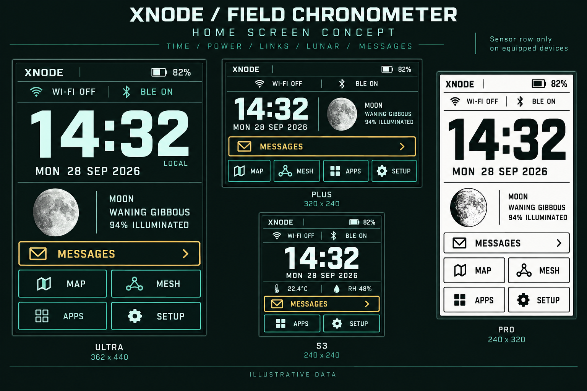

# XNODE Field Chronometer

Home-only tactical design proposal. Concept awaiting approval; firmware unchanged. Earlier main-gui concepts are preserved.

Large time and full date remain the primary readout. A compact top band consolidates battery/charging and Wi-Fi/Bluetooth state. Supported devices retain the computed moon phase and illumination directly on home. The existing conditional Messages shortcut becomes a broad command row. Map/Mesh shortcuts on larger displays and Apps/Setup navigation reuse existing destinations. Existing widgets and gestures remain available; no launcher or destination functionality is removed.

The sensor row is conditional on the existing temperature/humidity sensor availability, not a promised S3 hardware feature. Preserve configured time format, clock validity handling, battery events, wireless event distinctions and message-shortcut dismissal semantics. BLE ON in this illustrative board must become precise enabled/connected/disconnected wording based on actual state; enabled alone does not mean connected. Wi-Fi OFF should use a muted or crossed icon. Retain charging indication when charging.

Use Mission Teal family colors with selected-theme equivalents, bundled fonts and existing LVGL controls. E-paper requires binary shapes and functional phase geometry, no grayscale texture, animation or ticking seconds. The generated moon artwork is illustrative: implementation must use the existing calculated phase and illumination, not reproduce its photographed shadow or its example value/date relationship. No image-generation output is a new runtime dependency.

The artist render communicates hierarchy, not pixel-exact layout. Native layouts must fit 362x440 Ultra, 320x240 Plus, 240x240 S3 and 240x320 Pro. The board's apparent screen dimensions, type density and touch targets need native-resolution adjustment and physical-device verification. Existing moon drawing is functional geometry and may remain procedural. Small-screen navigation must remain usable when sensor or message rows appear/disappear; no shrinking essential text to fit decoration.

Source inventory: src/gui/mainbar/main_tile/main_tile.cpp supplies time/date, battery, Wi-Fi/Bluetooth, optional sensor data and conditional moon; existing widget registration provides home shortcuts. README.md and site/images/IMG_6786.jpg establish current installed-device appearance. Prior design/main-gui-2026-09-28 concepts provide the existing Mission Teal design direction. These references were inspected locally; no device was flashed or foreground session operated.

Generated with built-in ImageGen. Exact prompt: render-prompt.txt. All displayed values are illustrative. Scope is a reviewable proposal, not implementation or hardware acceptance. Original generated output remains in the tool-managed Codex generated_images directory; the project copy here is the canonical concept asset.
