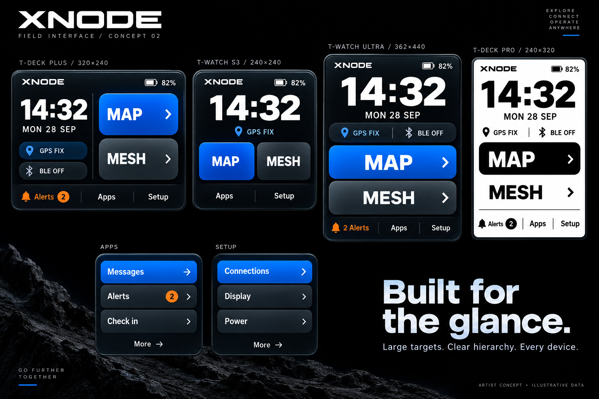

# XNODE main GUI — concept 02

This visual direction supersedes concept 01's outlined icon grid. Use bold typography, solid cobalt primary actions, graphite secondary surfaces, restrained depth and orange alert accents. The e-paper version translates this hierarchy to black and white. The presentation's surrounding terrain and promotional text are not application assets or proposed firmware content.

Home: dominant time, compact actual status, large Map and Mesh actions, Apps and Setup. Larger formats expose Alerts directly. Check in remains in Apps. Apps and Setup use broad labeled rows with a filled selection state; retain Back, page indication and accessible onward navigation in the implemented menu header/footer, although the artist's small menu studies omit those details.

Retain the workflow inventory and capability/power constraints in PROPOSAL.md, but replace its lime palette, icon grid and four-action home layout with this direction. Menu rows paginate according to available physical space. Preserve every existing entry, including SOS, Media and Watchfaces. Map and Mesh interiors remain a later stage.

The built-in ImageGen prompt is render-prompt-v2.txt. Artwork is illustrative, not a native-resolution firmware screenshot. Final embedded rendering must establish font fit, touch dimensions, color-depth/gradient quality, standby/wake and e-paper refresh behavior on all four targets.
