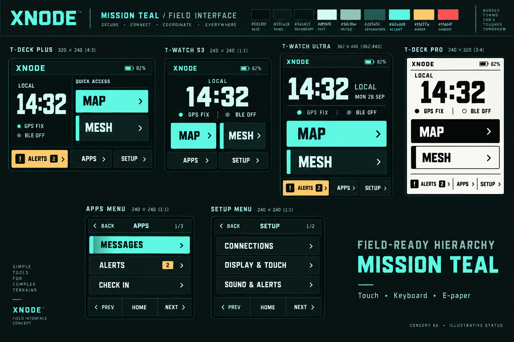

# XNODE Mission Teal — concept 03

Current proposed direction: retain concept 02's large typography and clear Map/Mesh access; adopt XTOC Mission Teal colors and a sharper military instrument character. Squared panels, strong command keys, condensed headings, tabular time, disciplined status bands and amber attention cues replace glossy cobalt consumer styling. Concept only; not implemented.

## Source palette

Read directly from `C:/GitHub/XTOC/xtoc-web/src/core/skinTheme.ts` (mission-teal preset) and `C:/GitHub/XTOC/xtoc-web/src/mission-skin.css`. Visual reference: `C:/GitHub/XTOC/docs/mission-skin-validation/xtoc-mission-teal-drones.png`.

| Role | Color |
| --- | --- |
| Background | #08100f |
| Panel | #101a19 |
| Secondary surface | #0a1413 |
| Primary text | #dff6f0 |
| Muted text | #9dc8be |
| Separator | #2d5a50 |
| Accent | #62edd8 |
| Warning | #ffd37a |
| Danger | #ff4d4f |

These literal tokens are authoritative for implementation; generated-image pixels are illustrative. E-paper uses a dedicated black/white translation. No new font dependency is authorized: achieve the illustrated hierarchy with existing bundled fonts or propose an exact font separately if needed.

## Menu organization

Three broad rows per 240px menu page, explicit Back, page number and Home/Prev/Next. Apps: Messages / Alerts / Check in; SOS / Map / Mesh; Media / Watchfaces plus any other enabled entries. Adapt page count to actual registered capabilities. Setup: Connections / Display & touch / Sound & alerts; Power / Time & sensors / System. Preserve all original handlers and entries as described in PROPOSAL.md.

Home includes Map and Mesh as the dominant command keys, real GPS/Bluetooth state and battery. Larger formats expose Alerts directly; smallest watch reaches Alerts through Apps. Make selection, primary-action emphasis and current navigation distinct. The render's teal Mesh strip is category emphasis, not a second keyboard focus target. Color is supplemented with text/shape. Do not classify every ordinary alert as a warning merely because the concept uses amber; actual severity and counts determine presentation.

Status is illustrative. Do not copy example counts or GPS fix into live UI. The board's promotional captions, trademark marks, palette strip and surrounding grid are presentation decoration, not requested application content. Preserve current branding; no security capability is established by generated presentation copy.

Map and Mesh interiors remain the next stage. Continue to apply offline, power, touch/keyboard, native-size, e-paper and physical-device acceptance constraints from the original proposal. This render is not physical-device validation.

Created with built-in ImageGen using the inspected local XTOC screenshot as a style reference. Reproducible prompt: render-prompt-v3.txt. Earlier concepts remain as revision history; this is the latest proposal.
