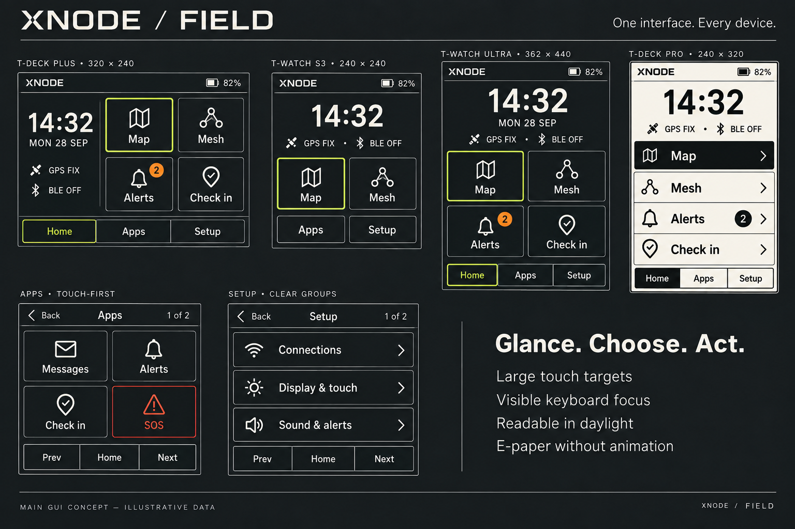

# XNODE Field — main GUI and menus

A coherent field-instrument interface across T-Watch S3, T-Watch Ultra, T-Deck Plus and T-Deck Pro. Fast recognition, deliberate actions and readable status define the direction.

## Scope

First stage: home/watchface, app launcher, setup navigation, shared headers/back controls, focus, notifications and menu feedback. Map and Mesh remain existing destinations; their interior layouts are the next design stage. Preserve all existing enabled apps, settings, saved records and device-specific capabilities.

## Visual language

- Dark charcoal surfaces, warm white primary text, restrained lime focus/accent, amber attention and red reserved for SOS/errors. Active theme colors remain configurable; selection must also use border/inversion and shape.
- Daylight variant uses white surfaces and black text. E-paper uses a dedicated binary black/white treatment, solid selection and no animated transitions, gradients or shadows.
- One consistent family of simple functional icons with visible text labels. Distinguish Mesh from Messages. Reuse bundled fonts; Ubuntu 16 is already available. No externally hosted fonts, images or packages.
- Starting sizes on 240px screens: 16px body/labels, 20–24px section titles, 40–56px home time, minimum 44px action height. Tune against physical size, clipping and touch performance; pixel counts alone do not establish usability.
- No scrolling marquee labels, ornamental radar or constant decorative animation. Color screens may use brief optional focus feedback; respect standby and power behavior.

## Device layouts

| Device | Current logical resolution | Proposed home |
| --- | --- | --- |
| T-Deck Plus | 320 × 240 | Time/status column; 2×2 Map, Mesh, Alerts, Check in; Apps and Setup navigation |
| T-Watch S3 | 240 × 240 | Time/status; two large Map and Mesh actions; Apps and Setup below |
| T-Watch Ultra | 362 × 440 | Larger time/date/status; generous 2×2 primary actions; Apps and Setup below |
| T-Deck Pro | 240 × 320 | Monochrome time/status; four full-width primary action rows; Apps and Setup below |

The artist board is enlarged and illustrative, not a pixel-exact layout specification. Its focus outlines illustrate possible selection styles; implementation has exactly one keyboard focus target at a time. Do not blindly reproduce the board's simultaneously highlighted Home and Map controls. Keep screen-edge safe areas and test supported rotations. Other legacy targets receive capability-driven layout fallback and require their own validation before support claims.

## Navigation and menus

Home always offers Map and Mesh directly. On larger screens it also offers Alerts and Check in. On the smallest watch these remain one Apps tap away. Keep a user-selectable conventional clock/watchface option; preserve existing watchface selections and moon information through the watchface flow rather than removing them.

Apps page 1: Messages, Alerts, Check in, SOS. Apps page 2: Map, Mesh, Media, Watchfaces. Append any additional enabled apps from the current registration system; never silently drop conditional apps. Four large cells per small-screen page, visible page number and explicit previous/next navigation. Touch swipe can supplement the buttons. Larger layouts can show additional items only if minimum sizes survive.

Setup is grouped into six readable categories over two pages:

1. Connections: Wi-Fi, Bluetooth, GPS.
2. Display & touch: brightness, timeout, themes, touch settings, watchfaces.
3. Sound & alerts: sound, notification settings and supported haptics.
4. Power: battery status/history and existing power controls.
5. Time & sensors: date/time and supported movement/sensor settings.
6. System: SD card, Utilities, update and other existing system functions.

Show only supported entries while preserving access to every registered setting. Grouping changes the navigation, not the meaning of existing controls. Category interiors can initially reuse existing settings pages. Keep explicit Back on every non-home screen, consistent Home access, and restore the previous menu page/focus when returning from an app.

## Input and operational feedback

- T-Deck: touch and physical keyboard navigation with a strong visible focus rectangle; Enter opens, Back returns. Integrate only inputs actually supported by the existing HAL. Do not claim trackball support from the hardware's appearance.
- T-Watch: tap targets and explicit navigation usable without hidden gestures. Swipes are optional shortcuts. Preserve physical button wake/back behavior.
- E-paper: update changed regions through the existing driver where supported; batch status updates, no ticking seconds or continuous animation. Validate ghosting and full-refresh cadence on hardware.
- Separate battery, GPS fix, Bluetooth connection and radio readiness. A local radio being ready does not prove reachable peers or successful message delivery. Unknown, disabled, stale and unavailable states use clear words rather than a misleading green indicator.
- Status opens a concise status view with individual details and existing setup routes. Avoid cramming every radio metric into the header.
- Alerts badge must use the real unread count if available; otherwise label it as total stored alerts. Do not invent unread state. Messages and pushed Alerts remain distinct sources.
- Check in opens its existing review/send flow. SOS opens the existing dedicated action screen, never transmits from a launcher tap. A future deliberate confirmation refinement should preserve cancellation and current prerequisites, and never label transmission as acknowledged delivery without evidence.
- Preserve drafts and existing privacy/retention behavior. Persist presentation preferences only through established settings storage; avoid unnecessary flash writes for transient menu focus.
- Demo/example presentation is visibly labeled and separate from operational state. Any implementation of the skill's first-open examples must use inert display-only previews; neither SOS nor Check in may transmit synthetic records. Real device readiness cannot be replaced by examples.

## Delivery sequence

1. Approve/refine this main GUI direction.
2. Implement shared visual tokens and capability-aware layout in existing LVGL; preserve handlers and data.
3. Update home, launcher, setup categories and navigation; exercise all retained menu actions.
4. Validate four native resolutions, actual target builds, offline/empty/error states, standby/wake, keyboard/touch and e-paper behavior. Then independently review actual screenshots and functionality against this concept, with the modernization skill's separate 9.5/10 gates.
5. Design Map and Mesh interiors using this same visual language, as a separate proposal.

No new external runtime or build dependencies are needed for the proposed direction.
